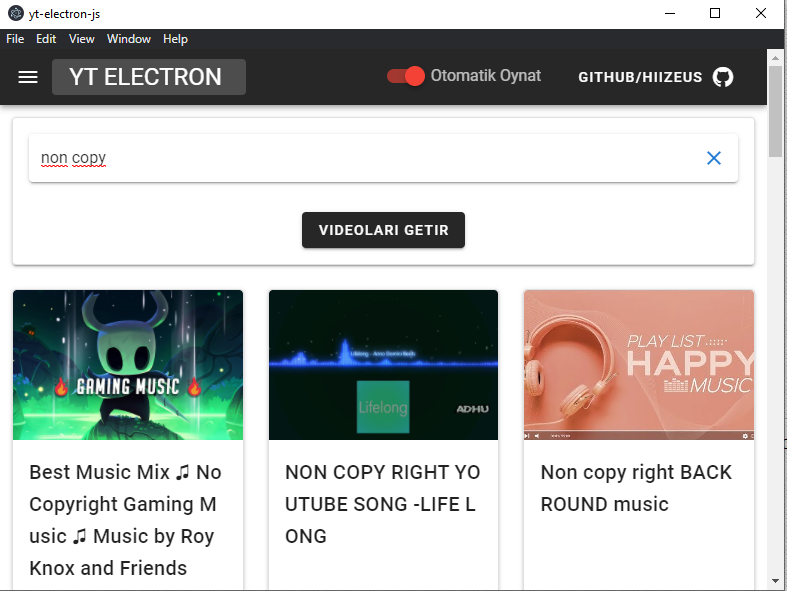
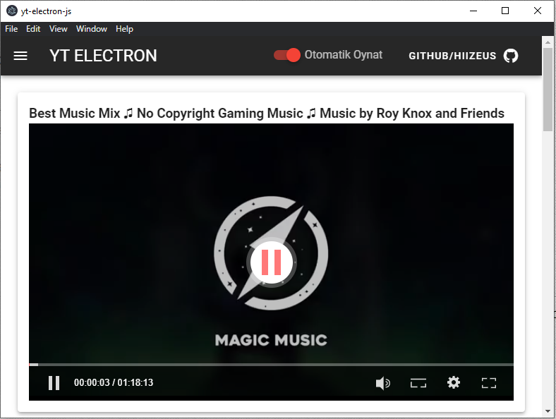
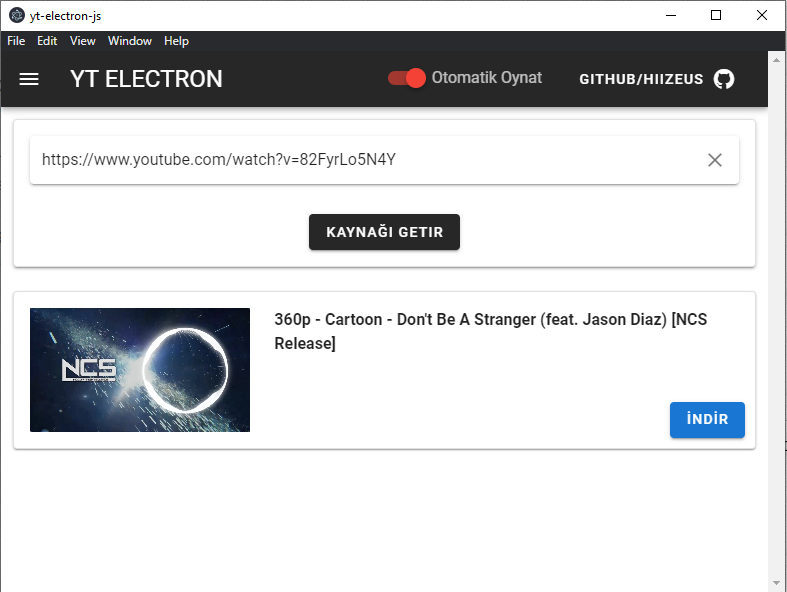

# yt-electron-js

## Projenin yapımında kullanılanlar:
- [Vue CLI Plugin Electron Builder](https://github.com/nklayman/vue-cli-plugin-electron-builder)
- [Electron](https://github.com/electron/electron)
- [Vue.js](https://vuejs.org/)
- [Vuetify](https://vuetifyjs.com/)
- [ytsr](https://github.com/TimeForANinja/node-ytsr)
- [ytdl-core](https://github.com/fent/node-ytdl-core)
- [vue-core-video-player](https://github.com/core-player/vue-core-video-player)

```
projeyi uygulama haline getirirseniz ilk açılışta boş bir sayfa geliyor yukardan
YT ELECTRON yazısına tıklayarak ana sayfaya gidebilirsiniz.
```

## Yapılanlar
- [x] Video arama
- [x] Video indirme
- [x] Video oynatıcı eklendi
- [x] Bir videodan otomatik olarak diğerine geçme özelliği eklendi

## Yapılacaklar
- [ ] İndirilenleri görme
- [ ] Çoklu indirme
- [ ] Belki başka şeyler ¯\\\_(ツ)_/¯


## Örnek ekran görüntüleri







## Proje kaynaklarının kurulumu

```
npm install
```

### Projeyi dev modda çalıştırma

```
npm run electron:serve
```

### Projeyi build ettme ve app olarak kullanmak için

```
npm run electron:build
```

### Proje build edilince setup yolu
```
dist_electron\yt-electron-js Setup 0.1.0.exe
```

